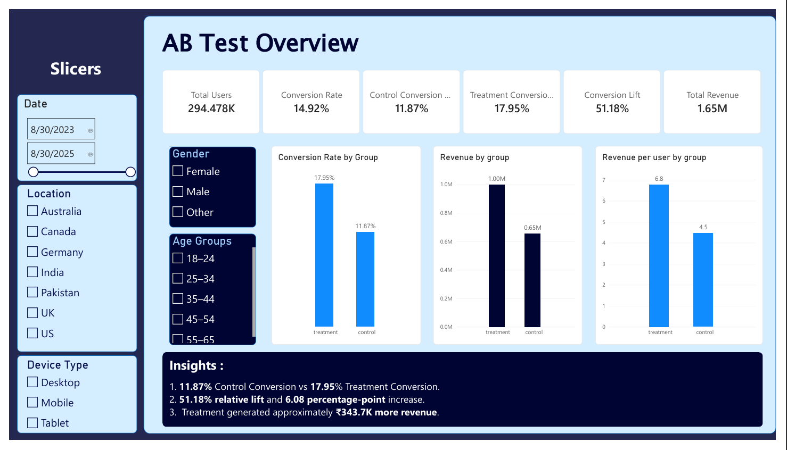
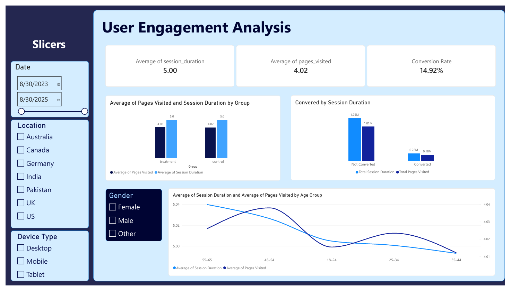
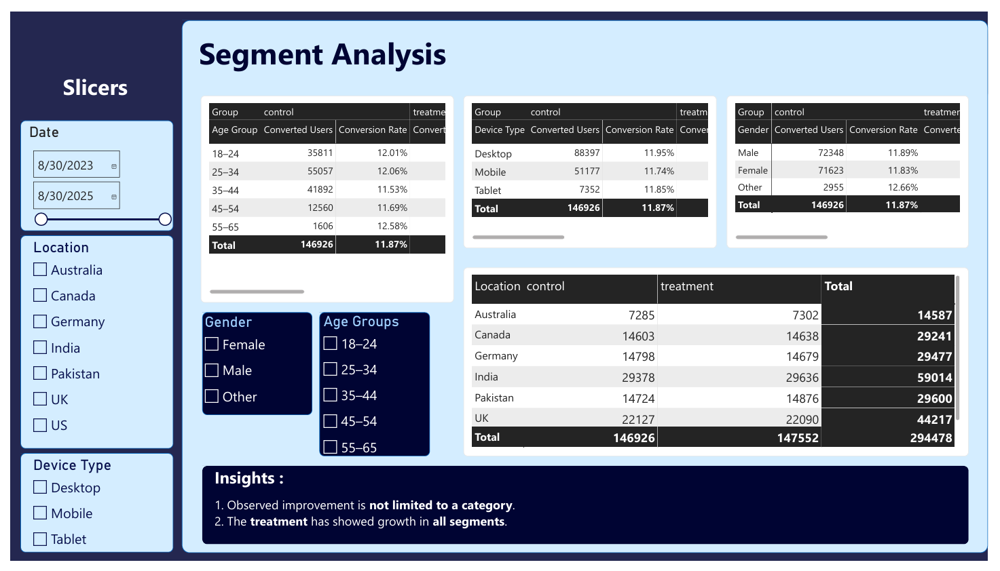

# A/B Testing Analytics: Landing Page Experiment

An end-to-end A/B testing analytics project evaluating whether a new landing page improves user conversion and revenue compared with the existing landing page.

The project combines **MySQL, Python, statistical hypothesis testing, and Power BI** to take the analysis from raw data validation to business insights and interactive reporting.

---

## 📌 Project Overview

A company wants to evaluate the performance of a **new landing page** against its existing landing page.

Users were divided into two experiment groups:

* **Control Group** → Existing/old landing page
* **Treatment Group** → New landing page

The objective is to determine whether the new landing page is associated with improved:

* Conversion rate
* Revenue
* Revenue per user
* User engagement
* Segment-level performance

The analysis follows an end-to-end data analytics workflow:

**Data Validation → SQL Analysis → Exploratory Data Analysis → AB Testing → Revenue Analysis → Segmentation → Power BI Dashboard → Business Insights**

---

## 🎯 Business Problem

The business needs to understand whether introducing a new landing page results in better user conversion and financial performance.

Simply observing a higher conversion rate is not enough. The analysis needs to determine:

1. How do conversion rates differ between control and treatment?
2. How large is the improvement?
3. Is the observed difference statistically significant?
4. Does the treatment generate more revenue?
5. Does revenue per user improve?
6. How does user engagement differ between groups?
7. Is the treatment effect consistent across different user segments?

---

## 🎯 Objectives

* Validate the quality and consistency of the experiment data.
* Compare control and treatment conversion rates.
* Calculate absolute conversion difference and relative lift.
* Perform statistical hypothesis testing.
* Estimate the confidence interval for the conversion-rate difference.
* Compare revenue and revenue per user.
* Analyze user engagement.
* Investigate performance across device, location, gender, and age segments.
* Build an interactive Power BI dashboard.
* Translate analytical results into business-oriented insights.

---

## 📊 Dataset

The dataset contains **294,478 user-level observations** and 12 columns.

| Column             | Description                            |
| ------------------ | -------------------------------------- |
| `user_id`          | Unique identifier for each user        |
| `timestamp`        | Date and time of the user interaction  |
| `group`            | Experiment group: control or treatment |
| `landing_page`     | Landing page shown to the user         |
| `converted`        | Conversion indicator (0 = No, 1 = Yes) |
| `age`              | User age                               |
| `gender`           | User gender                            |
| `location`         | User location                          |
| `session_duration` | Session duration in minutes            |
| `pages_visited`    | Number of pages visited                |
| `device_type`      | Device used by the user                |
| `purchase_amount`  | Purchase amount generated by the user  |

### Dataset characteristics

* **Rows:** 294,478
* **Columns:** 12
* **Unique users:** 294,478
* **Missing values:** None
* **Duplicate rows:** None
* **User-level duplicates:** None
* **Control users:** 146,926
* **Treatment users:** 147,552

The experiment groups are approximately balanced, supporting a direct comparison of their outcomes.

---

## 🛠️ Tools & Technologies

### SQL — MySQL

Used for:

* Data validation
* Aggregation
* Conversion analysis
* Revenue analysis
* Segment analysis
* Time-based analysis
* Reusable SQL views

### Python

Libraries:

* **Pandas** — data manipulation and analysis
* **NumPy** — numerical calculations
* **Matplotlib** — visualization
* **SciPy / Statsmodels** — statistical analysis and hypothesis testing

Used for:

* Exploratory Data Analysis
* Data validation
* Conversion analysis
* Statistical A/B testing
* Confidence intervals
* Engagement analysis
* Revenue analysis
* Segmentation

### Power BI

Used for:

* Data modeling
* DAX measures
* Interactive dashboards
* KPI reporting
* Segment analysis
* Business storytelling

---

# 🔎 Project Workflow

```text
Raw Dataset
     │
     ▼
Data Validation
     │
     ▼
MySQL / SQL Analysis
     │
     ▼
Python EDA
     │
     ▼
A/B Statistical Testing
     │
     ▼
Revenue & Engagement Analysis
     │
     ▼
Segment Analysis
     │
     ▼
Power BI Dashboard
     │
     ▼
Business Insights
```

# Power BI Dashboard

An interactive Power BI dashboard was developed to communicate the results to business stakeholders.

## Dashboard Pages

### 📈 Page 1 — A/B Test Overview

Focuses on:

* Total users
* Conversion rate
* Control vs. treatment comparison
* Conversion lift
* Revenue
* Revenue per user

**Business question:**

> Did the new landing page perform differently from the existing page?

---

### 👥 Page 2 — User Engagement

Focuses on:

* Session duration
* Pages visited
* Conversion status
* Group-level engagement

**Business question:**

> How does user behavior differ between experiment groups?

---

### 🎯 Page 3 — Segment Performance

Focuses on:

* Device
* Location
* Gender
* Age group
* Control vs. treatment performance

**Business question:**

> Is the observed treatment effect consistent across different user segments?

---

## 📸 Dashboard Preview

### A/B Test Overview


### User Engagement


### Segment Performance


# 💡 Key Insights

### Conversion

The treatment group achieved a **17.95% conversion rate**, compared with **11.87%** for control, corresponding to a **51.18% relative lift**.

### Statistical Evidence

The difference was statistically significant, with a **Z-statistic of 46.28 and p < 0.001**.

### Revenue

Treatment generated **₹997,938.36** compared with **₹654,227.55** for control.

### Revenue Efficiency

Revenue per user was **₹6.76** for treatment versus **₹4.45** for control.

### Engagement

Average session duration and pages visited were approximately identical across the two groups:

* 5 minutes
* 4.02 pages

### Segmentation

Segment analysis provides additional context for understanding whether the observed treatment difference is consistent across devices, locations, genders, and age groups.

---

# 📌 Business Recommendations

Based on the analysis:

1. **Investigate the treatment experience further** because it shows a substantially higher observed conversion rate than the control experience.

2. **Evaluate revenue efficiency alongside conversion**, particularly revenue per user, when assessing the business impact.

3. **Investigate segment-level differences** to understand whether particular user groups respond differently to the treatment.

4. **Run follow-up experiments** on specific landing-page elements such as headlines, calls-to-action, layout, images, or forms to identify which changes contribute to improved conversion.

5. **Monitor the treatment performance over time** before drawing conclusions about long-term business impact.

---

# ⚠️ Limitations

* Statistical significance does not automatically imply that an effect is sufficiently valuable from a business perspective.
* Total revenue should be considered alongside revenue per user and purchase behavior.
* Segment-level differences should be interpreted carefully, particularly when many segments are examined simultaneously.
* The analysis is based on the provided dataset and should not be presented as a live production experiment conducted by the analyst.
* The statistical test establishes evidence of a difference in conversion rates, but it does not by itself explain which specific element of the landing page caused the difference.
* Long-term effects such as customer retention and repeat purchases are outside the scope of this dataset.

---

# 📂 Project Structure

```text
AB-Testing-Analytics/
│
├── 📁 data
│   └── 📄 AB Testing Data.csv
├── 📁 images
│   ├── 🖼️ Table Relations.png
│   ├── 🖼️ engagement analysis.png
│   ├── 🖼️ overview.png
│   └── 🖼️ segment analysis.png
├── 📁 powerbi
│   └── 📄 AB Testing Dashboard.pbix
├── 📁 python
│   ├── 📄 AB_Test_analysis.ipynb
│   └── 🐍 python script.py
├── 📁 sql
│   ├── 📄 business_analysis_queries.sql
│   ├── 📄 data_validation_queries.sql
│   └── 📄 views.sql
└── 📝 README.md
```

---

# 🚀 Skills Demonstrated

This project demonstrates practical experience with:

* SQL data analysis
* MySQL
* Data validation
* Data cleaning
* Exploratory Data Analysis
* Python
* Pandas
* NumPy
* Statistical hypothesis testing
* Two-proportion z-test
* Confidence intervals
* Conversion-rate analysis
* Revenue analysis
* Revenue-per-user analysis
* Customer segmentation
* DAX
* Power BI
* Data visualization
* Dashboard development
* Business storytelling
* Analytical communication

---

# 📚 Key Analytical Concepts

Through this project, the following concepts were applied:

* A/B testing
* Control and treatment groups
* Conversion rate
* Absolute difference
* Relative lift
* Statistical significance
* p-value
* Z-statistic
* Confidence interval
* Revenue per user
* User engagement
* Segmentation
* Business impact analysis

---

# 👤 Author

**Sham Kedar**

Data Analyst Aspirant | SQL | Python | Power BI | Data Analytics

---

## ⭐ Project Summary

This project demonstrates an end-to-end approach to A/B testing analytics, combining **SQL for data validation and business analysis, Python for statistical analysis, and Power BI for interactive reporting**.

The analysis identified a substantial difference in conversion performance between the control and treatment groups, quantified the effect statistically, evaluated revenue impact, investigated user engagement and segmentation, and translated the findings into business-oriented insights.
